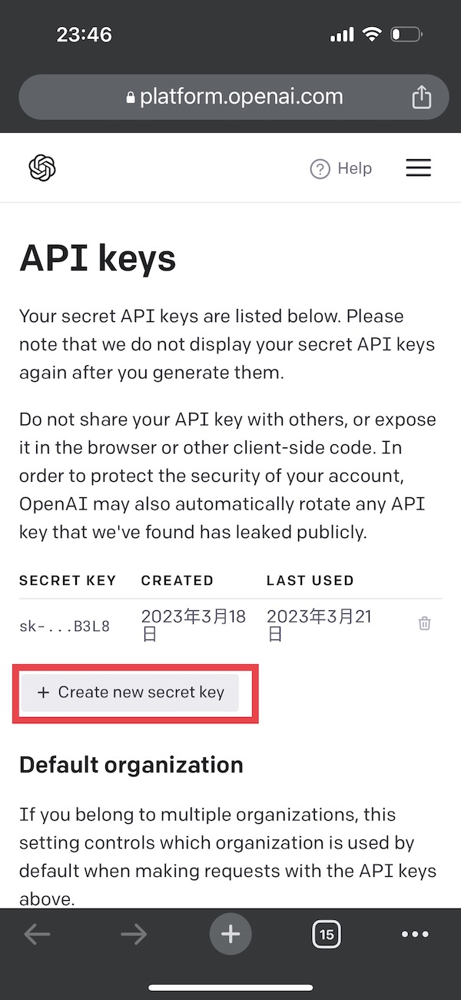
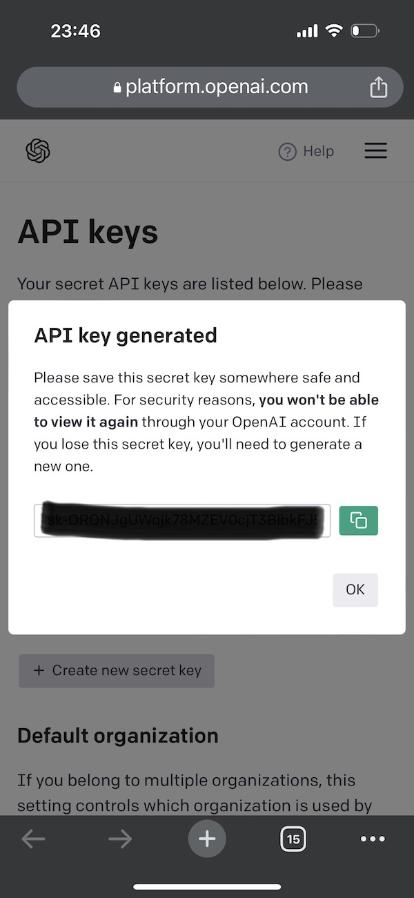
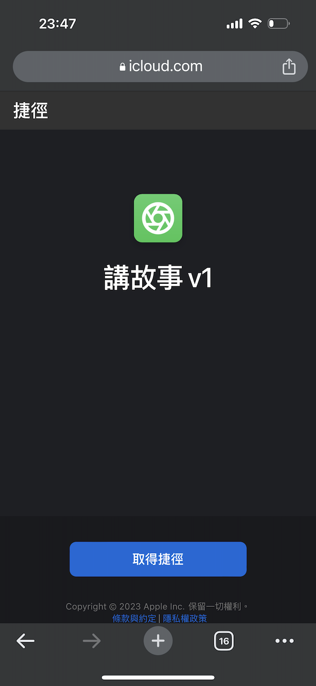
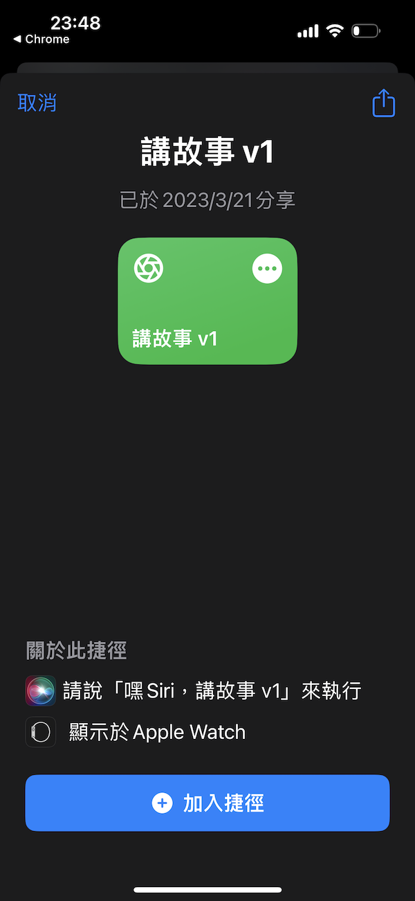
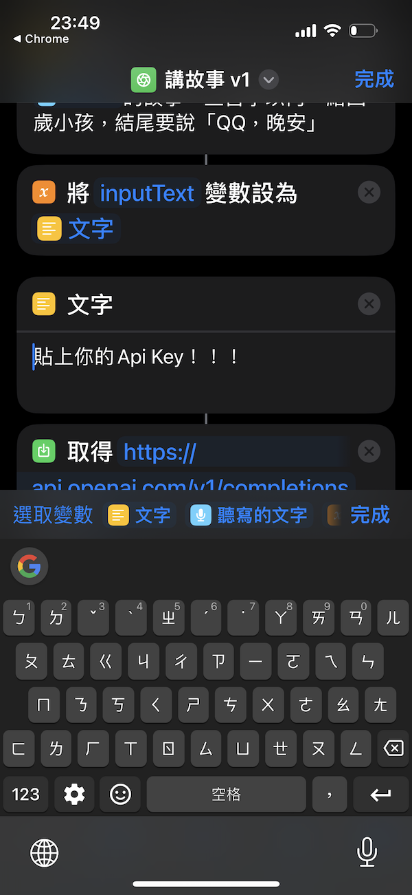
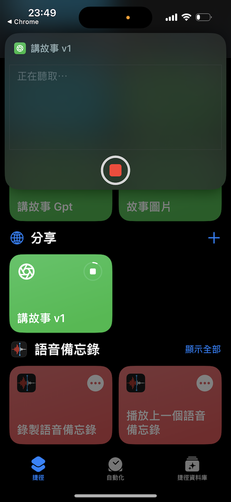

# chatgpt-read-a-bedtime-story
讓 Siri 變聰明，透過 Open AI (ChatGPT)講故事給小孩

# 實際操作影片
https://www.instagram.com/reel/CqDmYZIp_Fj/

# 步驟
1. 登入 Open AI
https://platform.openai.com/account/api-keys

2. 產生 API KEY

3. 複製捷徑
https://www.icloud.com/shortcuts/fe2f1c72c2954cd8804d68dc4fe37813

4. 貼上 API KEY

5. 開始玩囉！

## Inspired by
- https://github.com/Daiyimo/Access-chatGPT-in-Siri
- https://github.com/Yue-Yang/ChatGPT-Siri
